DApp de Permissionamento V2 da Rede Blockchain Brasil - RBB
# **Documentação do DApp de Permissionamento V2 da Rede Blockchain Brasil**
Esta documentação, descreve as funcionalidades do DApp de Permissionamento V2 para a Rede Blockchain Brasil - RBB, incluindo as telas principais e seus respectivos campos. O sistema é projetado para facilitar o gerenciamento de Contas, Nós, Organizações e Governança.

## **1. Tela de Contas**
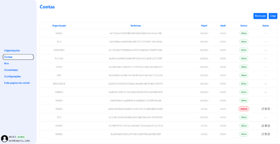

O conteúdo gerado por IA pode estar incorreto.](Aspose.Words.10335795-d574-4faa-ab3b-ecdc7c0557b5.001.png)
### **Descrição**
Esta tela exibe todas as contas registradas na rede, mostrando informações como Organização, Endereço, Papel, Hash e Status, além de permitir a criação, atualização e remoção de contas.
### **Elementos Principais**
- ### **Organização:** Nome da entidade proprietária da conta.
- ### **Endereço:** Identificador exclusivo da conta.
- ### **Papel:** Indica o escopo da conta, que pode ser global ou local.
- ### **Hash:** Representação criptográfica do endereço.
- ### **Status:** Indica se a conta está Ativa ou Inativa.
- ### Opções para atualizar ou remover uma conta.

### **Janela Criar Conta**
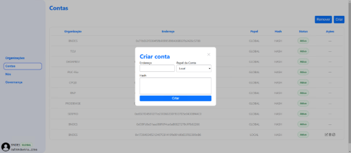

**Descrição:**
Permite adicionar uma nova conta à rede.
### **Campos:**
- **Endereço:** Campo para inserir o endereço da nova conta.
- **Papel da Conta:** Seleção entre Global ou Local.
- **Hash:** Campo para inserir o hash associado.
### **Botão:**
- **Criar:** Confirma a criação de uma nova conta.

### **Janela: Atualizar Conta**
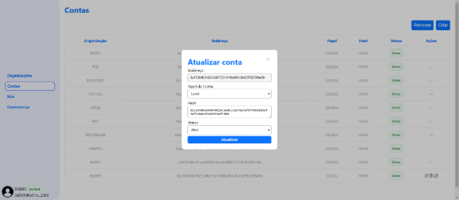

**Descrição:**
Permite atualizar informações de uma conta existente.
### **Campos:**
- **Endereço:** Exibe o endereço da conta em atualização.
- **Papel da Conta:** Permite modificar entre Global e Local.
- **Hash:** Campo para atualizar o hash.
- **Status:** Opção para definir como Ativo ou Inativo.
### **Botão:**
- **Atualizar:** Salva as alterações feitas na conta.

### **Janela: Remover Conta**
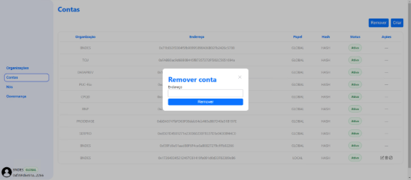

**Descrição:**
Possibilita a remoção de uma conta da rede.
### **Campo:**
- **Endereço:** Campo para inserir o endereço da conta a ser removida.
### **Botão:**
- **Remover:** Confirma a exclusão da conta.

## **2. Tela de Nós**
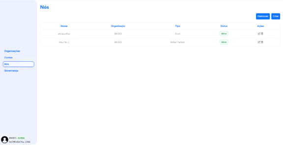
### **Descrição**
### A tela de Nós permite gerenciar os nós da rede, exibindo informações como Nome, Organização, Tipo, Status e opções para editar ou remover nós.
### **Elementos Principais**
- ### **Nome:** Identificação do nó.
- ### **Organização:** Entidade responsável pelo nó.
- ### **Tipo:** Categoria do nó, como Boot ou Writer Partner.
- ### **Status:** Indica se o nó está Ativo.
- ### **Ações:** Opções para editar ou remover o nó.

### **Janela: Remover Nó**
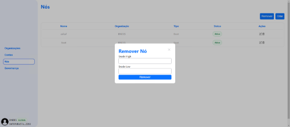

**Descrição:**
Permite a remoção de um nó da rede.
### **Campos:**
- **Enode High:** Campo para inserir o identificador Enode High.
- **Enode Low:** Campo para inserir o identificador Enode Low.
### **Botão:**
- **Remover:** Confirma a remoção do nó.

### **Janela: Atualizar Nó**
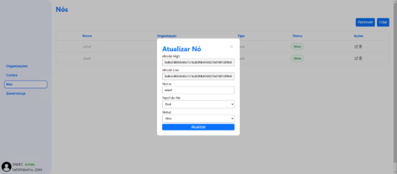

**Descrição:**
Permite atualizar informações de um nó existente.
### **Campos:**
- **Enode High:** Identificador de alta prioridade do nó.
- **Enode Low:** Identificador de baixa prioridade do nó.
- **Nome:** Modificação do nome do nó.
- **Papel do Nó:** Seleção do tipo de papel (por exemplo, Boot).
- **Status:** Definido como Ativo ou inativo.
### **Botão:**
- **Atualizar:** Salva as alterações feitas no nó.
### **Janela: Criar Nó**
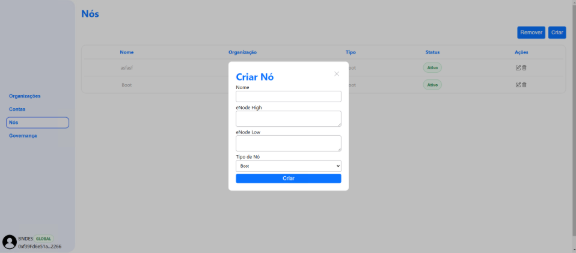

**Descrição:**
Facilita a criação de um novo nó.
### **Campos:**
- **Nome:** Nome do novo nó.
- **Enode High:** Campo para inserir o identificador Enode High.
- **Enode Low:** Campo para inserir o identificador Enode Low.
- **Tipo de Nó:** Seleção do tipo de nó.
### **Botão:**
- **Criar:** Inicia o processo de criação do novo nó.

## **3. Tela Organizações**
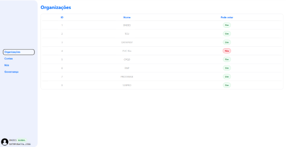
### **Descrição**
### A tela de Organizações exibe a lista de organizações participantes da rede, indicando se cada uma tem permissão para votar.

### **Elementos Principais:**
- **ID:** Identificador único da organização.
- **Nome:** Nome oficial da organização.
- **Pode votar:** Indica se a organização tem permissão para votar em propostas (Sim ou Não).

## **4. Tela de Governança**
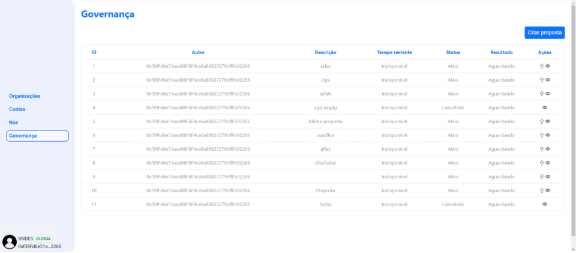
### **Descrição**
### A tela de Governança permite visualizar e administrar propostas de governança, possibilitando criar, editar, visualizar votos e cancelar propostas.

### **Elementos Principais:**
- **ID:** Identificador único da proposta.
- **Autor:** Endereço da conta que criou a proposta.
- **Descrição:** Breve resumo da proposta.
- **Tempo Restante:** Indica o tempo restante para a votação.
- **Status:** Estado atual da proposta (Ativo, Cancelado, etc.).
- **Resultado:** Estado do resultante da votação.
- **Ações:** Opções para visualizar detalhes, editar ou cancelar uma proposta.
### **Janela: Proposta / Votos**
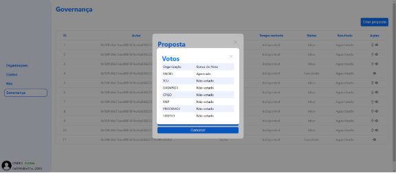

**Descrição:**
Exibe o status de votos de diferentes organizações para uma proposta específica.
### **Campos:**
- **Organização:** Entidade envolvida na votação.
- **Status do Voto:** Indica se o voto foi Aprovado ou Não Votado.
### **Botão:**
- **Cancelar:** Fecha a janela de visualização de votos.
### **Janela: Cancelar Proposta**
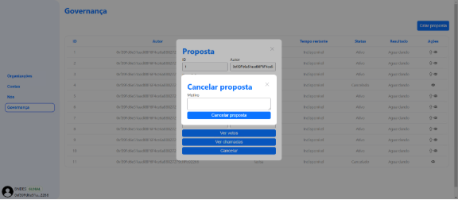

**Descrição:**
Permite cancelar uma proposta existente, especificando o motivo do cancelamento.
### **Campo:**
- **Motivo:** Texto que explica o motivo do cancelamento.
### **Botão:**
- **Cancelar Proposta:** Confirma o cancelamento da proposta.
### **Janela: Criar Nova Proposta**
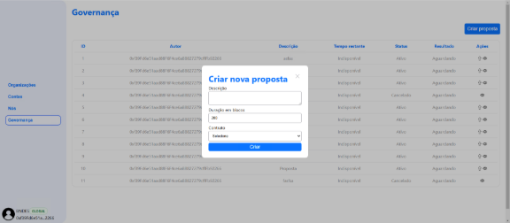

**Descrição:**
Facilita a criação de uma nova proposta de governança.
### **Campos:**
- **Descrição:** Breve descrição da proposta.
- **Duração em blocos:** Define o tempo de duração da proposta em blocos.
- **Contrato:** Seleção do contrato relevante para a proposta.
### **Botão:**
- **Criar:** Inicia o processo de criação da nova proposta.
### **Janela: Detalhes da Chamada da Proposta**
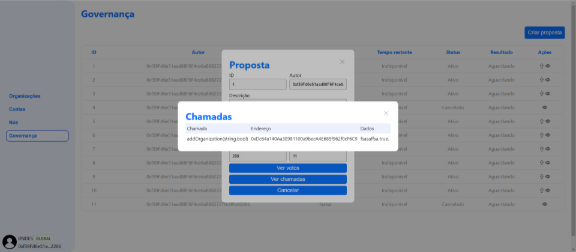

**Descrição:**
Detalha as chamadas execução da proposta.
### **Campos:**
- **Chamada, Endereço, Dados:** Mostram informações sobre cada chamada.

